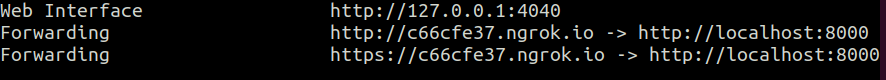

<h1 align="center">BotMan Studio</h1>

## About Quizbot Studio
This project is a Chat bot that integrates with Telegram App and is built using  [http://botman.io](http://botman.io)

## SetUp

	Clone this project on to your local Machine

	Head to this URL and follow instruction to create your bot on telegram [BotFather] (https://core.telegram.org/bots#3-how-do-i-create-a-bot)

	When you are done you will be giving a key; in your laravel application '.env' file add it as the example below

	TELEGRAM_TOKEN=your-telegram-token-here

- We'll Use a Service Called [ngrok](https://ngrok.com/) to create secure introspectable tunnels. This will enable to connect Botman to the telegram Bot via 'https'

	Download and Install ngrok By following instruction on their page

- Start your local server  on port 8000 by running the following command

  php artisan serve 

- Open another Terminal and Go to your home directory and run the comand below

  ./ngrok http 8000

	Now shoul see some ouput similar to this

	

- Register Your Webhook
	To let your Telegram Bot know, how it can communicate with your BotMan bot, you have to 

	register the URL where BotMan is running at, with Telegram

  [https://api.telegram.org/bot<YOUR-TELEGRAM-TOKEN-HERE>/setWebhook](https://api.telegram.org/bot<YOUR-TELEGRAM-TOKEN-HERE>/setWebhook)

- In your terminal type

	php artisan botman:telegram:register

	and Follow the prompt

	Use the link provided by ngrok and append ‘botman’ to it

	For instance in our case [https://c66cfe37.ngrok.io/botman](https://c66cfe37.ngrok.io/botman)

	If everything was successful you should see in your console this message

	“Your bot is now set up with Telegram's webhook!”

	To make sure the bot is connected to our application, type Hi. In your Telegram app web interface to your bot

	Below are some of the commands you can use to Interact with the bot

- /start  to begin conversatio with the bot
- /highsccore  	to Display Highscore
- /about  	to show Info About this project
- /deletedata  	to Delete Data

## License

BotMan is free software distributed under the terms of the MIT license.

